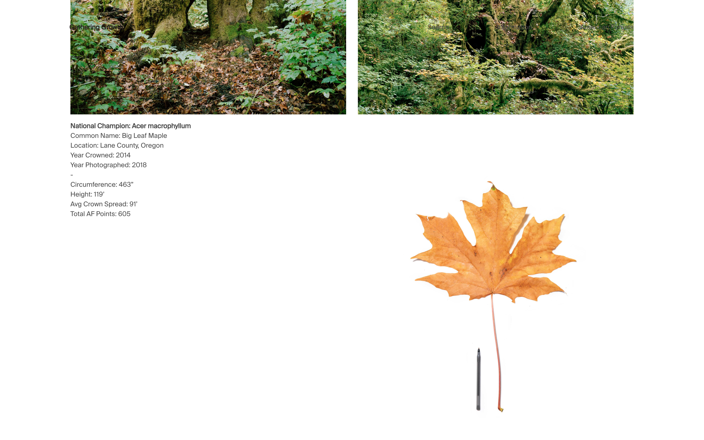

Gathering Growth is a project by photographer / archivist [Brian Kelley](http://www.briankelley.nyc/) & Sara Meghdari which has partnered with [American Forests](https://www.americanforests.org/get-involved/americas-biggest-trees/) to create a photographic archive of Champion Trees in the United States.

I built a site with Gatsby integrated with Netlify CMS to display and search through the photos & data collected. Gatsby's static build output & progressive image handling helped make a sizeable, image-heavy site into a performant experience.

[https://www.gatheringgrowth.com/](https://www.gatheringgrowth.com/)

