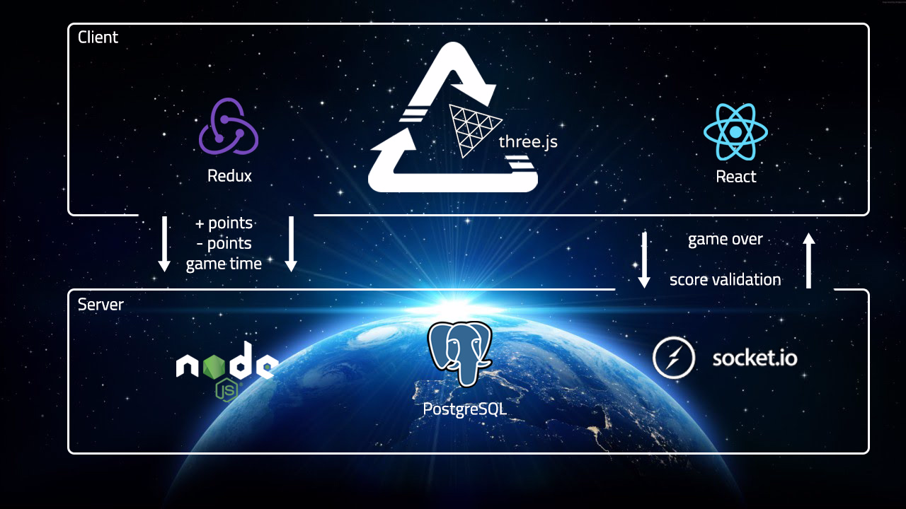
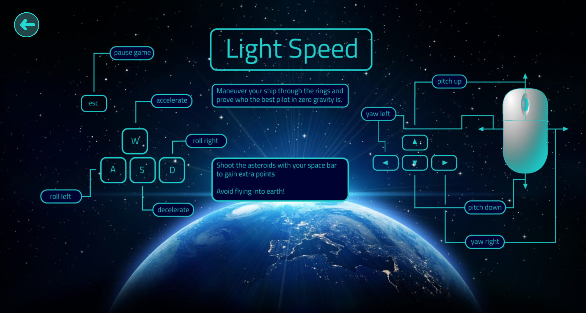
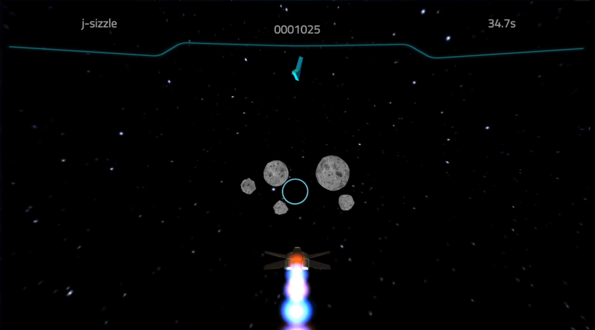

Light Speed is a 3D space flight game where points are accumulated as players shoot asteroids & race through rings that are dynamically positioned. The game is built on an architecture of Three.js, React, Redux, Node, WebSockets, & PostgreSQL. We made custom Blender models and built out a Three.js resource manager to improve client-side game performance.

