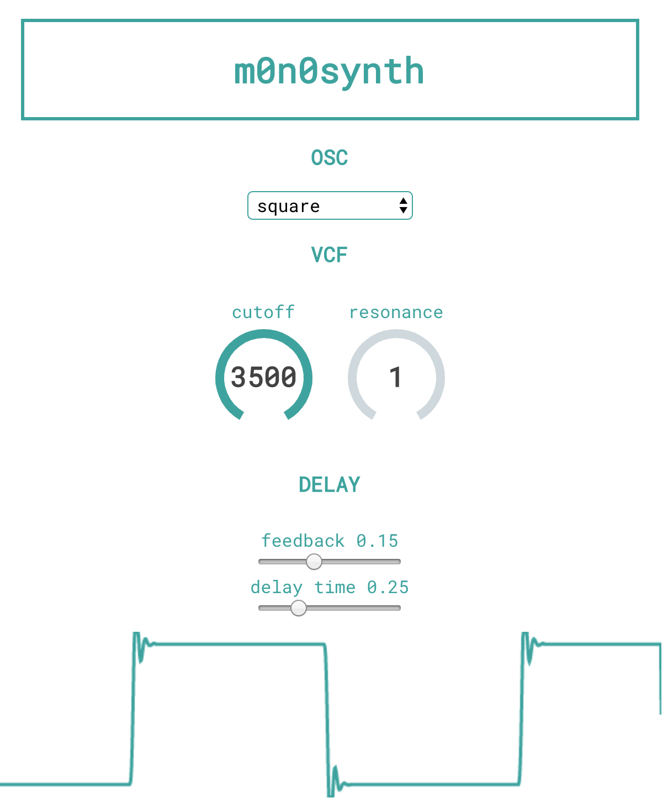

Single oscillator synthesizer that's played through your keyboard and uses the Web Audio API to dynamically render waveforms from within your browser. The interface was built with React and it incorporates a feedback delay at the end of the signal chain from the Tone.js library. The oscilloscope was built from the Web Audio API's analyser node.

[http://m0n0synth.com](http://m0n0synth.com/)

